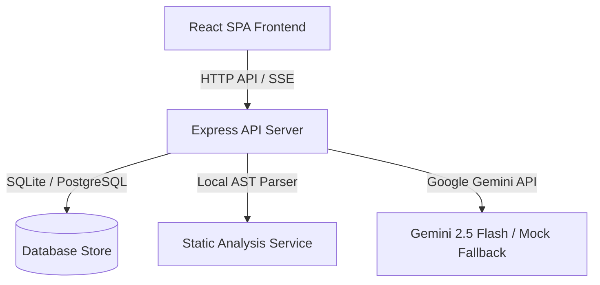

# AI Engineering Workshop (v1.0.0)


A production-grade, portfolio-ready developer intelligence platform that transforms raw code repositories into structured engineering reports, interactive visual topologies, risk heatmaps, mock interview preparation decks, and ATS-scorecard resume packages.

It acts as an **AI CTO, Security Auditor, and Interview Coach** for software engineering portfolios.

---

## 🚀 Features

### 1. Repository Intelligence Inspector
- **3-Pane Split View**: Interactive File Tree explorer, Code Viewer pane, and AI Inspector sidebar.
- **AST Metrics Deck**: Generates complexity scores, maintainability indexes, security risk levels, and documentation coverage metrics.
- **Dependency & Import Map**: Scans and parses imported npm packages, resolving internal imports vs external packages dynamically.
- **Function Intelligence**: Lists every defined method with its estimated complexity, risk assessment, and technical purpose.

### 2. Executive Engineering Report Generator
- **Flagship Scorecard**: One-click generation of detailed developer audits.
- **11 Review Pillars**: Covers Executive Summary, Engineering Review, Architecture, Security, Performance, Testing, Documentation, Technical Debt, Startup Readiness, Hiring Recommendations, and CTO Advice.
- **Multi-Format Exporters**: Downloads print-ready `.txt` briefings, structured `.json` metrics, and Github-ready `.md` audits.

### 3. SVG Dependency Topology Explorer
- **Visual Canvas**: Renders SVG nodes with drag-to-pan, scroll-to-zoom, and layout reset capabilities.
- **Layer Filters**: Toggles visibility across Frontend SPA, Backend Server, API Routes, Services, Database Models, and Utilities.
- **Rich Floating Tooltips**: Displays complexity percentiles and layer descriptions on mouse hover.
- **Code Explorer Integration**: Clicking any node navigates directly to the corresponding source file.

### 4. Code Risk Heatmap & checklist
- **Interactive Grid**: Visualizes cyclomatic complexity and risk hotspots using color-coded grid blocks.
- **Column-Sorted checklist**: Sorts files by Risk, Complexity, Security, and Maintainability.
- **AI Audit Recommendation**: Details issues found, recommended fixes, and performance impact for the selected file.

### 5. AI Interview Coach & Viva prep
- **Readiness Gauges**: Displays competency bars for System Design, Behavior, Viva, Security, and Architecture.
- **Interactive Radar Chart**: Maps mock scoring metrics dynamically.
- **Weakness File Mapping**: Pinpoints security and architectural weaknesses directly to clickable source paths.
- **STAR Story Evaluator**: Analyzes user answers against expected responses, rating length and keyword matching.

### 6. Resume & LinkedIn Package Center
- **ATS Scorecard**: Radial gauges calculating resume strength, keyword coverage, and technical depth.
- **STAR Case-Study Generator**: Outlines situation, task, action, and results for key engineering achievements.
- **Exporters**: Downloads plain text, markdown, and print layout outreach templates.

---

## 📐 Architecture

The platform operates on a decoupled client-server architecture with an offline fallback model for high portability:



- **Frontend**: Serves as the interactive developer workspace, handling visual renders, graph drawing, state mapping, and file uploads.
- **Backend**: Exposes secure REST endpoints, triggers localized directory static analysis, structures AST parsing, handles database records, and dispatches AI prompts.

---

## 🛠️ Tech Stack

- **Frontend**: React (v19), TypeScript, Vite, Recharts, Framer Motion, Lucide Icons, Vanilla CSS.
- **Backend**: Node.js, Express, TypeScript, tsx execution runtime.
- **Storage**: PostgreSQL (production database) and SQLite (automatic local file fallback).
- **Tooling**: Playwright (E2E testing), Vitest (component & unit testing), ESLint (static code analysis).

---

## 📸 Screenshots

*Ensure screenshots are placed under the `/screenshots` directory:*

- **Dashboard**: 
- **Risk Heatmap**: 
- **Architecture**: 
- **Interview Prep**: 
- **Resume Package**: 

---

## 📂 Folder Structure

```
├── .github/workflows/      # GitHub Actions CI/CD pipelines
├── backend/                # Express & Node.js API server
│   ├── src/                # Backend TypeScript source files
│   ├── Dockerfile          # Multi-stage production backend Docker build
│   └── package.json        # Backend dependencies and CLI script definitions
├── frontend/               # React client SPA
│   ├── src/                # Frontend React components & hooks
│   ├── Dockerfile          # Nginx production build Docker configuration
│   └── package.json        # Frontend dependencies
├── e2e/                    # Playwright end-to-end user flows
├── screenshots/            # UI screenshot assets
├── docker-compose.yml      # Orchestrates database, backend, and frontend
└── package.json            # Root workspace configuration
```

---

## 💻 Running Locally

### Prerequisites
- Node.js (v18+)
- npm (v9+)

### Installation
1. Clone the repository and navigate to the root directory:
   ```bash
   cd "AI Engineering Workshop"
   ```
2. Install all dependencies:
   ```bash
   npm run install:all
   ```

### Running Locally
To launch both the backend Express listener and the frontend Vite server concurrently:
```bash
npm run dev
```
* Access the client at `http://localhost:3000`
* Backend API listening on `http://localhost:5000`

---

## 🐳 Docker Setup

The platform is fully containerized for production deployment. Start the entire stack with a single command:

```bash
docker compose up -d --build
```

### Services Defined:
1. **database**: Runs PostgreSQL 15 alpine image with volumes mapping to host for persistent storage.
2. **backend**: Serves the API endpoints on port `5000`. Connects to postgres database using a service health check condition.
3. **frontend**: Built with a production React static build served by Nginx on port `3000`. Uses fallback routing to support client SPA pathing.

---

## 🧪 Testing

The codebase implements comprehensive testing coverage across unit, integration, and E2E layers.

### Run Backend Tests (Vitest)
```bash
npm run test --prefix backend
```

### Run Frontend Tests (Vitest)
```bash
npm run test --prefix frontend
```

### Run E2E Tests (Playwright)
Ensure local dev servers are active before executing E2E flows:
```bash
npx playwright test
```

### Run Typechecks
```bash
npm run typecheck --prefix backend
npm run typecheck --prefix frontend
```

---

## ⚙️ CI/CD

Continuous Integration and Delivery workflows are managed via GitHub Actions:
- **`ci.yml`**: Installs dependencies, runs lints, typechecks source directories, executes unit/integration tests, and compiles production build bundles.
- **`security.yml`**: Runs Gitleaks secret scanner on pushed commits and performs npm security audits.
- **`docker.yml`**: Validates backend and frontend Docker builds on pull requests.
- **`release.yml`**: Triggered on publication of a new GitHub Release, packaging compiled builds and uploading assets automatically.

---

## 🔮 Future Improvements

- Add integrations for GitHub App permissions to sync repositories automatically on webhook triggers.
- Support deep semantic vector embedding caching using ChromaDB or pgvector.
- Integrate SonarQube CLI rules for security scanning reports.

---

## ✍️ Author

**Rishi Sharma** - *All rights reserved.*
